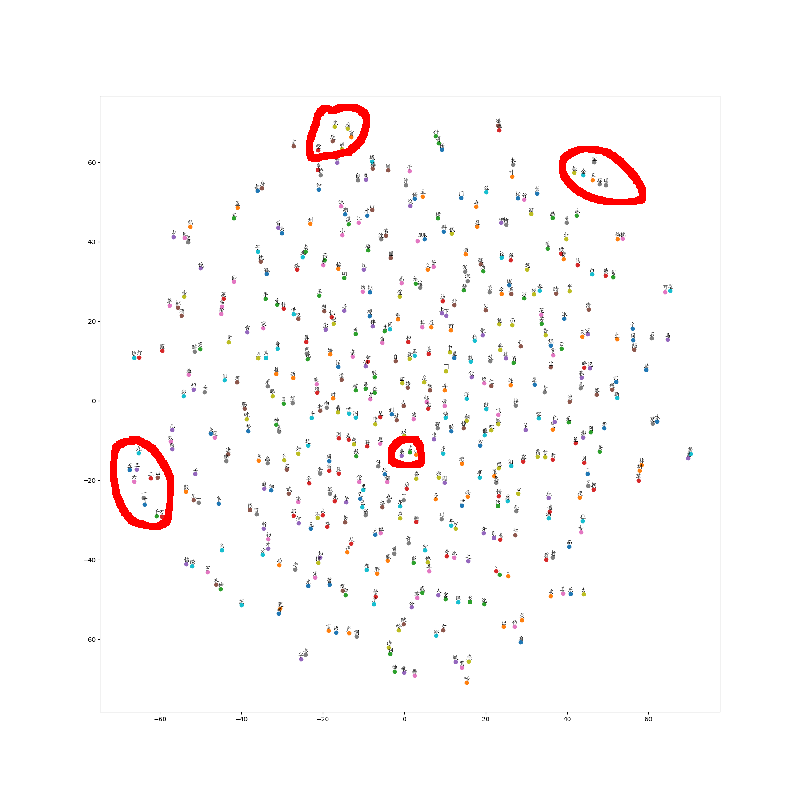

# 自动写词机器人-RNN

## 数据集
使用《全宋词》

下载网址：https://pan.baidu.com/s/16o8h-ZYA_69VhcCPB6_PRQ

代码下载地址 ：https://github.com/Leikun0303/AI100-W11

## 第一部分: 基于word2vec,对全宋词进行文字嵌入(word embedding)

### 数据处理

全宋词数据集中包含作者名,词牌名,空行,以及生僻字显示异常等情况, 如:
江无□
满江红（衡岳词）
使节行秋，算天也、知公风力。长啸罢、烟云尽卷，□□□□。重九汉峰黄泛酒，五更泰岳□观日。问扬公、去后有谁□，□朝集。大华□，□□□。今古□，□陈迹。甚牛山□□，□□□□。□□□嫌口薄，高怀□□□□□。□□□、黄鹤□□□，□相识。

有如下几点考虑:
1. 对于作者名,词牌名后面()中注解等文字,应该从训练数据中剔除: 文件并没有很明显的词正文和词牌名的分隔符

一般作者和词牌名的长度都较短，根据宋词词牌名的特点，最长词牌大概7个字，如凤凰台上忆春宵；最短的有2个字的，如暗香

根据原始的语料文件，首先是作者，然后是词牌名+正文的形式给出。

为了把作者剔除，首先需要将原始语料库的空行和分行符\n删除掉，然后判断是作者的办法就是当前行小于4个字符，并且第二行小于14个字符（为啥不是7，而是14，根据分析词牌名后面还跟着（）等备注,14这个长度基本上可以将词牌名所在行和正文行区分开）。

词牌名备注都是有中文的（）的，通过这个信息就能把这种词牌名筛出来。

2. 对于像上面的例子,显示异常字符太多的词句，应该算作没有正作用的语料库了，应该剔除，试验发现对结果也没啥影响，最终提交的程序没有对这个进行剔除。

3. 原始语料库中还有很多不是按照词牌名规则填的词，比如下面这个“喜迁莺”词：
喜迁莺（代邑士送梁宰观赴昆山同知）南庐佳号。是自许孔明，经纶才调。对柳鸣琴，凭花制锦，小试一同谈笑。怎知画帘难驻，忽又星舆催召。但谶得、耀碑潭水月，交光相照。

驿道。春正好。簇帐擎杯，听取殷勤祷。略鲙松鲈，便膺芝凤，陵溯紫清津要。当家得时行志，回首旧封文庙。疏化雨，障狂澜不尽，生生芹藻。

它的平仄句式就是错误的。这种情况也时间有限，也无从筛选了。正确的打开方式应该是这样的：
```	
	李煜：喜迁莺（晓月坠）
    晓月坠，宿云微，无语枕频攲。[中仄仄，仄平平，平仄仄平平。]
    梦回芳草思依依，天远雁声稀。[仄平平仄仄平平，平仄仄平平。]
    啼莺散，馀花乱，寂寞画堂深院。[平中仄，平中仄，仄仄仄平平仄。]
    片红休扫尽从伊，留待舞人归。[中平平仄仄平平，平仄仄平平。]
```
### 程序第1步 读入文件

```py
def read_data(filename):
    # 读取中文宋词
    line_words = []
    with open(filename,"r",encoding="UTF-8") as f:
        line = f.readline() # 逐行读入，将每行的换行符删除
         while line:
            while '\n' in line:
                line = line.replace('\n','') # 换行符替换
            line_words.append(line)
            line=f.readline()
    words = []
    for lw in line_words:
        words += [w for w in lw]
    return words

filename='iQuanSongCi.txt' #处理过的语料库
vocabulary = read_data(filename)
```
### 程序第2步 创建文字->编号；编号-->文字 字典

build_dataset这个函数的代码和原来word2vec一样，这里不再介绍

### 程序第3步 采用skip-gram模型，构件训练数据和标签数据

```py
batch_size=8, num_skips=2, skip_window=1
```
即训练数据的标签就是字符序列的第二个文字

如 我爱中华人民共和国，根据上面的设置，一个batch就是
训练数据： 我爱中华人民共和
标签数据： 爱中华人民共和国

generate_batch这个函数，其中有段代码需要修改：
```py
    if data_index == len(data):
    	# buffer[:] = data[:span] 
        # 这么写会报错:sequence index must be integer, not 'slice'
        for w in data[:span]:
    		buffer.append(w)
    		data_index = span
    else:
    	buffer.append(data[data_index])
    	data_index += 1
```
### 程序第4步 创建skip-gram模型

embedding_size = 128
首先，需要定义词嵌入矩阵
```py
mbeddings = tf.Variable(tf.random_uniform([vocabulary_size, embedding_size], -1.0, 1.0))
```
矩阵的大小为语料长度 X 嵌入长度（一般取128），采用【-1 1】的随机幅值

然后，要定义词库中每个词的权重和偏置项：
```py
nce_weights = tf.Variable(tf.truncated_normal([vocabulary_size, 
				embedding_size],stddev=1.0 / math.sqrt(embedding_size)))
nce_biases = tf.Variable(tf.zeros([vocabulary_size]))
```
每个文字都需要转化为一个唯一对应的整数，
```py
train_inputs = tf.placeholder(tf.int32, shape=[batch_size])
train_labels = tf.placeholder(tf.int32, shape=[batch_size, 1])
```
batch中的每个文字通过tf.nn.embedding_lookup这个函数查找对应的嵌入向量

模型的损失函数，采用的是NCE损失，
```py
 loss = tf.reduce_mean(tf.nn.nce_loss(weights=nce_weights,
                                        biases=nce_biases,
                                        labels=train_labels,
                                        inputs=embed,
                                        num_sampled=num_sampled,
                                        num_classes=vocabulary_size))
```
tf.nn.nce_loss详细参考https://blog.csdn.net/jiasudu1234/article/details/78676922

### 程序第5步 训练skip-gram模型

训练步数设置了40W步

### 程序第5步 可视化词嵌入

为了显示中文，需要指定中文字体
在linux中，通过输入：
fc-match -v "AR PL UKai CN"
获取中文字体路径。

```py
from sklearn.manifold import TSNE
import matplotlib.pyplot as plt
from matplotlib.font_manager import FontProperties # 字体属性定义

# ubuntu中输入命令:fc-match -v "AR PL UKai CN"获得中文字体路径
zhfont =FontProperties(fname="/usr/share/fonts/truetype/arphic/ukai.ttc") #中文字体  

tsne = TSNE(perplexity=30, n_components=2, init='pca', n_iter=5000, method='exact')
plot_only = 500
low_dim_embs = tsne.fit_transform(final_embeddings[:plot_only, :])
labels = [reverse_dictionary[i] for i in xrange(plot_only)]
plot_with_labels(low_dim_embs, labels, 'tsne_new.png',fonts=zhfont)
```
最终显示的效果为：



可见意义相近的文字距离都比较近。


## 第二部分: 基于RNN的自动写词机器人

### utilis.py
utilis.py中主要包含文字处理相关的代码：

函数fix_data()用来处理原始语料，这个函数在第一部分就用到了

函数read_data()从来读取处理后的语料文件，这个函数第一部分也用到

函数build_dataset(words, n_words)用来创建文字与编号的字典，为了在后续验证不在重复生成，增加了字典的保存代码，
```py
# 将字典保存到当前路径,供后续使用
f=open('dictionary.json', 'w')
f.write(json.dumps(dictionary))
f.close()
f=open('reversed_dictionary.json', 'w')
f.write(json.dumps(reversed_dictionary))
f.close()
```
函数get_train_data(vocabulary, dictionary, batch_size, num_steps)是返回每个epoch的训练数据x和标签y

首先需要将vocabulary按照batch_size长度等分为长度为len_batch的数组
```py
# 所有batch的训练和标签数组
x_batches = np.zeros([batch_size, len_batch], dtype=np.int32)
y_batches = np.zeros([batch_size, len_batch], dtype=np.int32)
```
然后将每个batch中的训练和标签文本（训练文本的下个文本）转化为编号

最后对每个batch按照num_steps等分为epoch_size大小的训练样本
```py
for i in range(epoch_size):
    x = x_batches[:, num_steps*i : num_steps*(i+1)]
    y = y_batches[:, num_steps*i : num_steps*(i+1)]
    yield(x, y)
```
### model.py

model.py为RNN模型的构件文件

首先，中文需要通过查找词嵌入矩阵获得训练的样本的向量
```py
self.lstm_inputs = tf.nn.embedding_lookup(embed, self.X)
#self.lstm_inputs = tf.one_hot(self.X, self.num_words)
```
但是发现用独热编码也能进行训练，得到的结果同样不怎么地。

然后，是构建RNN，本例采用LSTM模型，每个RNN cell由基本BasicLSTMCell和DropoutWrapper组成，然后通过MultiRNNCell将多层cell组织起来
```py
# 基础cell 也可以选择其他基本cell类型
def lstm_cell():
    lstm =tf.nn.rnn_cell.BasicLSTMCell(
                                    num_units=self.dim_embedding,
                                    forget_bias=0, 
                                    state_is_tuple=True)
    drop = tf.nn.rnn_cell.DropoutWrapper(lstm,
    								output_keep_prob=self.keep_prob)
    return drop

# 多层cell 前一层cell作为后一层cell的输入 ,一共rnn_layers层
cell = tf.nn.rnn_cell.MultiRNNCell(
                    [lstm_cell() for _ in range(self.rnn_layers)] ,
                    state_is_tuple=True)
```
在tf 1.4版本中，多层cell的组建 需要通过*lstm_cell() for _ in range(self.rnn_layers)*实现，网上很多博客写的*lstm_cell()\*self.rnn_layers*这种形式是无法正确运行的。

输出的预测* lstm_outputs_tensor, state = tf.nn.dynamic_rnn(cell, inputs=self.lstm_inputs, initial_state=self.init_state, time_major=False)*

time_major=False这样可以保证 预测结果logits是[batch_size, num_classes]

注意logits还不是我们通常说的预测结果，预测结果还需要softmax获得：
*self.predictions = tf.nn.softmax(logits, name='predictions')*

需要对标签也要按照这个大小reshape：
```py
y_one_hot = tf.one_hot(self.Y, self.num_words)
labels = tf.reshape(y_one_hot, logits.get_shape())
```
这样就可以计算损失函数了：
*loss = tf.nn.softmax_cross_entropy_with_logits(logits=logits,labels=labels)*

不能用*tf.nn.sparse_softmax_cross_entropy_with_logits*这个损失函数，以为它的输入labels是大小为[batch_size]的一维数组

这个loss是一个向量，还需要tf.resuce_sum求得平均值作为损失

### train.py

train.py训练自动写词机器人
```py
for dl in get_train_data(vocabulary, dictionary, batch_size=FLAGS.batch_size, num_steps=FLAGS.num_steps):
    feed_dict = {
            model.X:dl[0], 
            model.Y:dl[1],
            model.keep_prob:0.9, 
            model.init_state:state}

    grobal_step, _, state, loss, summary_string = sess.run([model.global_step,
            model.optimizer, 
            model.final_state, 
            model.loss, 
            model.merged_summary_op], feed_dict=feed_dict)
```
传入模型的参数有每个epoch的x和y等参数，返回运行步数，h层(state)，损失函数等

### 训练的输出

```py
...
2018-06-06 00:08:25,703 - DEBUG - train.py:96 - step [17090 / 17427] loss [6.143946647644043]
2018-06-06 00:08:26,310 - DEBUG - train.py:96 - step [17100 / 17427] loss [6.513155937194824]
2018-06-06 00:08:26,886 - DEBUG - train.py:96 - step [17110 / 17427] loss [6.992983818054199]
2018-06-06 00:08:27,488 - DEBUG - train.py:96 - step [17120 / 17427] loss [5.809717178344727]
2018-06-06 00:08:28,099 - DEBUG - train.py:96 - step [17130 / 17427] loss [6.667610168457031]
2018-06-06 00:08:28,706 - DEBUG - train.py:96 - step [17140 / 17427] loss [6.041753768920898]
2018-06-06 00:08:29,368 - DEBUG - train.py:96 - step [17150 / 17427] loss [6.146536827087402]
2018-06-06 00:08:30,020 - DEBUG - train.py:96 - step [17160 / 17427] loss [6.621719837188721]
2018-06-06 00:08:30,621 - DEBUG - train.py:96 - step [17170 / 17427] loss [6.321609020233154]
2018-06-06 00:08:31,232 - DEBUG - train.py:96 - step [17180 / 17427] loss [6.290590763092041]
2018-06-06 00:08:31,826 - DEBUG - train.py:96 - step [17190 / 17427] loss [5.947303295135498]
2018-06-06 00:08:32,413 - DEBUG - train.py:96 - step [17200 / 17427] loss [6.442729949951172]
2018-06-06 00:08:33,022 - DEBUG - train.py:96 - step [17210 / 17427] loss [6.670993804931641]
2018-06-06 00:08:33,666 - DEBUG - train.py:96 - step [17220 / 17427] loss [6.824639320373535]
2018-06-06 00:08:34,305 - DEBUG - train.py:96 - step [17230 / 17427] loss [5.939784049987793]
2018-06-06 00:08:34,881 - DEBUG - train.py:96 - step [17240 / 17427] loss [6.0925116539001465]
2018-06-06 00:08:35,495 - DEBUG - train.py:96 - step [17250 / 17427] loss [6.11519718170166]
2018-06-06 00:08:36,120 - DEBUG - train.py:96 - step [17260 / 17427] loss [6.4069414138793945]
2018-06-06 00:08:36,716 - DEBUG - train.py:96 - step [17270 / 17427] loss [6.0815749168396]
2018-06-06 00:08:37,314 - DEBUG - train.py:96 - step [17280 / 17427] loss [6.148395538330078]
2018-06-06 00:08:37,917 - DEBUG - train.py:96 - step [17290 / 17427] loss [7.114985942840576]
2018-06-06 00:08:38,511 - DEBUG - train.py:96 - step [17300 / 17427] loss [6.200233459472656]
2018-06-06 00:08:39,160 - DEBUG - train.py:96 - step [17310 / 17427] loss [6.5492634773254395]
2018-06-06 00:08:39,745 - DEBUG - train.py:96 - step [17320 / 17427] loss [6.445711612701416]
2018-06-06 00:08:40,319 - DEBUG - train.py:96 - step [17330 / 17427] loss [6.300273418426514]
2018-06-06 00:08:40,892 - DEBUG - train.py:96 - step [17340 / 17427] loss [6.405479907989502]
2018-06-06 00:08:41,462 - DEBUG - train.py:96 - step [17350 / 17427] loss [6.501202583312988]
2018-06-06 00:08:42,050 - DEBUG - train.py:96 - step [17360 / 17427] loss [6.331655025482178]
2018-06-06 00:08:42,631 - DEBUG - train.py:96 - step [17370 / 17427] loss [6.3117265701293945]
2018-06-06 00:08:43,268 - DEBUG - train.py:96 - step [17380 / 17427] loss [6.12898063659668]
2018-06-06 00:08:43,854 - DEBUG - train.py:96 - step [17390 / 17427] loss [6.416743278503418]
2018-06-06 00:08:44,441 - DEBUG - train.py:96 - step [17400 / 17427] loss [6.626370429992676]
2018-06-06 00:08:45,006 - DEBUG - train.py:96 - step [17410 / 17427] loss [6.210209369659424]
2018-06-06 00:08:45,683 - DEBUG - train.py:96 - step [17420 / 17427] loss [6.68043327331543]
```
输入了三个词牌，'江神子', '蝶恋花', '水调歌头' 让模型自动写词：

```py
2018-06-06 00:14:30,573 - INFO - tf_logging.py:116 - Restoring parameters from ./rnn_log/model.ckpt-17420
2018-06-06 00:14:30,603 - DEBUG - sample.py:55 - restore from [./rnn_log/model.ckpt-17420]
2018-06-06 00:14:30,715 - DEBUG - sample.py:90 - ==============[江神子]==============
2018-06-06 00:14:30,715 - DEBUG - sample.py:91 - 声。一笑一番，一笑一番，一笑一番春。水调歌头一笑，一番一笑，一笑一番春。水调歌头一笑，一番一笑，一笑
2018-06-06 00:14:30,802 - DEBUG - sample.py:90 - ==============[蝶恋花]==============
2018-06-06 00:14:30,802 - DEBUG - sample.py:91 - 一笑一番，一笑一番，一笑一番春。一笑一番，一笑一番，一笑一番。一笑一番，一笑一番，一笑一番。一笑一番
2018-06-06 00:14:30,880 - DEBUG - sample.py:90 - ==============[水调歌头]==============
2018-06-06 00:14:30,880 - DEBUG - sample.py:91 - 笑，一笑一番。一笑一番，一笑一番，一笑一番。一笑一番，一笑一番，一笑一番。一笑一番，一笑一番，一笑一
```

结果很“感人”。

看来要想让机器人写成好的词，简单RNN模型构建是达不到效果的。

查阅了相关资料，发现自动写诗词的程序，一直就有人在研究，用了他们的程序，运行的结果还相当不错。

周昌乐提出用遗传算法应用到宋词生成上，有微信版，叫作诗机。得到的诗词效果还不错。

最近像百度等公司也在研究深度学习写诗词，也有不少学者研究了深度学习的写诗词，但是中国的古典诗词博大精神，就单单做到工整，平仄押韵，主题相关这些诗词最基本的，深度学习面临不少挑战，如果要做到古人写的诗歌那种一个字就点出意境，似是而非有合情合理，让人拍手称快的诗词来，还需要不断探索。

我会继续研究研究现在提出的几篇深度学习的写诗词的论文，看看能否提高写诗词的质量 。

本来想将一些论文思想应用到本作业来，限于时间和理解深度不够，没有成功，马上就要大作业了，今天也不得不完成这个作业，进行毕业作业的准备中。

相关的作业代码见github：

https://github.com/Leikun0303/AI100-W11


